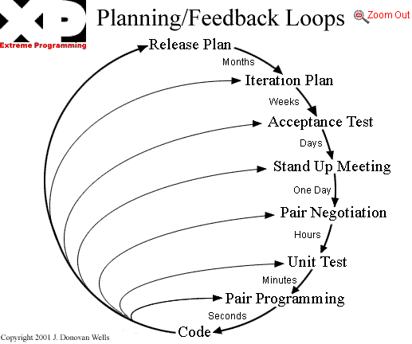

= Der Feedback Loop
:source-highlighter: highlightjs 

## Feedback loop



## Test-Arten

### Unit Test

[quote, Wikipedia, 'https://de.wikipedia.org/wiki/Modultest[Modultest]']
____
...Modultests testen ein Modul isoliert, d. h. weitgehend ohne Interaktion mit anderen Modulen...
____

### Integration Test

[quote, Wikipedia, 'https://de.wikipedia.org/wiki/Integrationstest[Integrationstest]']
____
...Einzeltests, die dazu dienen, verschiedene voneinander abhängige Komponenten eines komplexen Systems im Zusammenspiel miteinander zu testen...
____

### Warum trennen?

* Integration Tests liegen von der Dauer der Ausfuehrung im *Sekundenbereich*
* Unit Tests liegen im *Millisekundenbereich*
* Tests sollten hauptsaechlich Unit Tests sein
* Sind die Tests getrennt, koennen sie separat ausgefuehrt werden
* Minimierung der Feedback Zeit

### Wie trennen?

Das Maven Failsafe Plugin zusaetzlich konfigurieren!


## Das failsafe Plugin

[quote, Maven Failsafe Plugin, 'https://maven.apache.org/surefire/maven-failsafe-plugin/[Docs]']
____
"The Failsafe Plugin is designed to run integration tests while the Surefire Plugin is designed to run unit tests"
____

### Was macht das Failsafe Plugin?

* wird in der maven Phase ``integration-test`` ausgefuehrt  +
  vs. surefire wird in Phase ``test`` ausgefuehrt
* included automatisch alle Testklassen mit Endung ``IT``  +
  z.B. ``PropertyTranslationDaoIT``

### Phasen (1)

```xml
...
<phase>package</phase>
<!-- BEGIN relevante phasen -->
<phase>pre-integration-test</phase>
<phase>integration-test</phase>
<phase>post-integration-test</phase>
<!-- END relevante phasen -->
<phase>verify</phase>
...
```

http://maven.apache.org/ref/3.3.9/maven-core/lifecycles.html[Maven lifecycle]

### Phasen (2)

* Waehrend der Phase ``integration-test`` wird das ``failsafe``-Plugin aufgerufen
* Die Pre und Post Phasen koennen fuer Umgebungs-Setup (z.B. Tomcat Hoch- und Runterfahren, DB Setup/Teardown) benutzt werden

### Parent POM (1)

[source,xml]
----
....
<build>
  <pluginManagement>
    <plugins>
      <plugin>
        <groupId>org.apache.maven.plugins</groupId>
        <artifactId>maven-surefire-plugin</artifactId>
        <configuration>
          <skipTests>${skip.surefire.tests}</skipTests>
        </configuration>
      </plugin>
      ...
    </plugins>
    ...
----
https://stackoverflow.com/questions/6612344/prevent-unit-tests-in-maven-but-allow-integration-tests[Stackoverflow - Skip Unit But Allow Integration Tests]

### Parent POM (2)

[source,xml]
----
.... 
<build>
  <pluginManagement>
    <plugins>
      ... 
      <plugin>                    
        <groupId>org.apache.maven.plugins</groupId>                    
        <artifactId>maven-failsafe-plugin</artifactId>                    
        <version>2.22.0</version>                    
        <executions>                        
          <execution>                            
            <id>integration-test</id>                            
            <goals>                                
              <goal>integration-test</goal>                                
              <goal>verify</goal>                            
            </goals>                        
          </execution>
        </executions> 
      </plugin>
    </plugins>
    ...
----

### Aktivierung von failsafe in module-pom

[source,xml]
----
<build>
  <plugins>
    ...
    <plugin>
      <groupId>org.apache.maven.plugins</groupId>
      <artifactId>maven-failsafe-plugin</artifactId>
    </plugin>
  </plugins>
</build>
...
----


## Selektive Ausfuehrung von Test-Arten

Wie kann ich selektiv verschiedene Test Arten ausfuehren?


### (Nur) Ausfuehren von Unit Tests

```sh
mvn install -DskipITs
```
https://maven.apache.org/surefire/maven-failsafe-plugin/examples/skipping-tests.html[Failsafe Docs - Skipping Tests]


### (Nur) Ausfuehren von Integration Tests

```sh
mvn install -Dskip.surefire.tests=true
```
http://maven.apache.org/surefire/maven-surefire-plugin/examples/skipping-tests.html[Surefire - Skipping Tests]
https://stackoverflow.com/questions/6612344/prevent-unit-tests-in-maven-but-allow-integration-tests[Stackoverflow - Skip Unit But Allow Integration Tests]


### Ausfuehren eines einzelnen Tests
i
```sh
mvn -Dit.test=ITCircle verify
```
https://maven.apache.org/surefire/maven-failsafe-plugin/examples/single-test.html[Failsafe - Single Test Execution]


## Migration von Tests

Und wie geht die Migration konkret?

NOTE: Kein Big-Bang gewuenscht, nur inkrementelle Migration!


## Migration a

Unit -> Integration Test


### Unit -> Integration Test

Testklassen, die nur Integration-Tests enthalten (z. B. viele ``*DaoTest`` etc.), und die z.B. einen Spring Kontext explizit benoetigen,
werden einfach von ``*Test`` in ``*IT`` umbenannt. Diese werden dann z.B. mit 

```sh
mvn clean verify
```

nach den Unit-Tests ausgefuehrt.


### Unit -> Integration Test (2)

BackendReturnCodeTest.java -> BackendReturnCodeIT.java

[source,java]
----
@RunWith(SpringJUnit4ClassRunner.class)
@Transactional("transactionManagerSup")
@ContextConfiguration(locations = {
  "classpath:/config/**/pum_dao_spring.xml", 
  "classpath:test_pum_dao_spring.xml"
})
public class BackendReturnCodeIT extends AbstractDAO_SUP_Test {
  ...
}
----


## Migration b


### *Test und *IT parallel (1)

Bei manchen Klassen sind Unit-Tests und Integration-Tests gemischt vorhanden.

Fuer diesen Anwendungsfall koennen parallel eine ``*Test`` und eine ``*IT`` Klasse per zu testender Klasse existieren.


### *Test und *IT parallel (2)

Bei diesem Ansatz benennt man die Klasse von ``*Test`` in ``*IT`` um.

```java
@RunWith(SpringJUnit4TestRunner.class)
@ContextConfiguration(...)
public class PropertyTranslationDaoIT { 
  // renamed from PropertyTranslationDaoTest
...
}
```

### *Test und *IT parallel (3)

Dann werden die reinen Unit-Tests in die zuvor neu angelegte ``*Test`` Klasse verschoben.


### *Test und *IT parallel (4)

Abschliessend wird entweder

* der Spring-Kontext der ``*Test`` Klasse soweit wie moeglich ausgeduennt oder
* der Test-Runner auf ``JUnit4.class`` gesetzt,  +
  die echten Abhaengigkeiten der ``*Test`` Klasse durch Mocks ersetzt und abschliessend  +
  die ``@ContextConfiguration`` entfernt


### *Test und *IT parallel (5)

```java
// since EasyMock 3.6, PARENT_POM >= 1.02
@RunWith(EasyMockRunner.class) 
public class PropertyTranslationDaoTest {

  @Mock(value = NICE, fieldName = "jdbcTemplate")
  private JdbcTemplate               mockJdbcTemplate;
  ...
  @TestSubject
  private PropertyTranslationDao     propertyTranslationDao 
      = new PropertyTranslationDao();
  ...  
}
```


## Q&A

__That's all folks!__

mailto:daniel.hiller.extern@bertelsmann.de[Fragen? Anregungen?]
